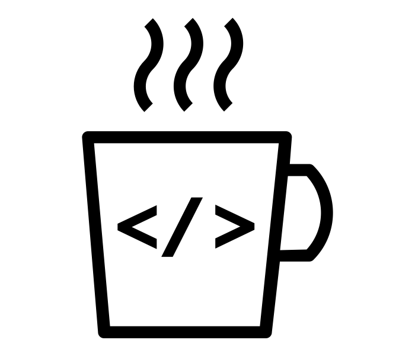
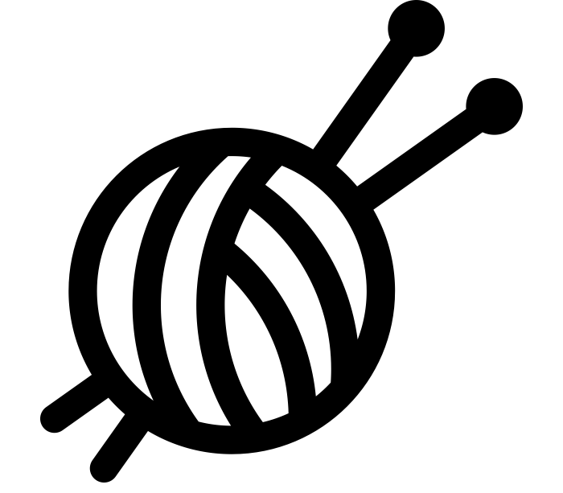
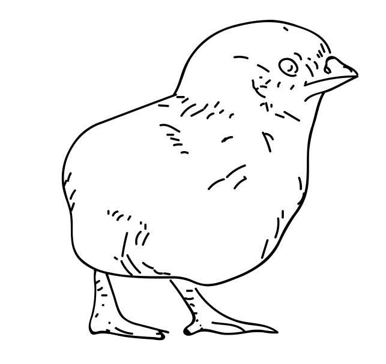
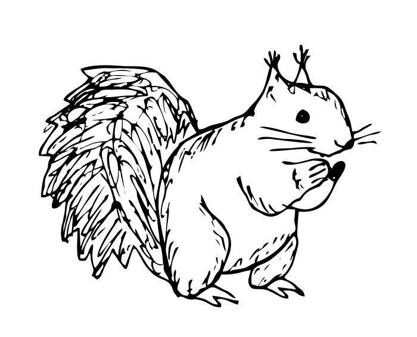

<mark>This document is currently in draft</mark>

```{r setup, include=FALSE}
knitr::opts_chunk$set(warning = FALSE, message = FALSE, error = FALSE)
library(emo)
```



# Intro

## Blurb

>Do you have *woolly* knowledge of document creation in R? *Needle* little help? Matt Dray will *drop* some *purls* of wisdom and unravel a *yarn* about the *knitty*-gritty of R Markdown and the ‘knitr’ package for one-click document creation. Don’t get the *point*? If a deadline is *looming*, you’ll avoid a *stitch*-up from endless re-running of code and copy-pasting of outputs into a Word document. Come along and have a *ball*!

## TL;DR

We should make reproducible reports using R Markdown documents. This puts our analysis and commentary in the same place and makes it easier to avoid error, recreate documents with new parameters and generally speed up our work.

## Disclaimer

This is not an exhaustive guide. It's purely to introduce and demonstrate the basic workings of R Markdown and how to turn it into a document for sharing. Let me know if you want a section added or want to find out more about something.

## Why?

Potential (typical?) steps for creating a document to share with our customers:

1. Read and analyse data and produce outputs (plots, tables, etc)
2. Copy-paste/save-embed these outputs in a Word document
3. Discover error (this step may recur)
4. Re-do analysis, output creation and copy-pasting
5. Customers want something to be tweaked (this step may recur)
6. Re-do analysis, output creation and copy-pasting
7. Try and reproduce the outputs at some point in the future but you can't remember the exact steps for creating your outputs and the copy-paste sequence (this step may recur)

(I'll assume that you're using R for the read/analyse/output steps for the purposes of this document. Note that this workflow is actually longer and more error prone if you *don't* use R.)

We can make this process simpler, reduce the chance for error and speed up production by using R Markdown documents.

R Markdown documents allow you to manipulate data and create documents *in the same place*. This makes document generation simpler, reduces the chance for error and speed up production. Changes can be made swiftly and efficiently and a record of your workflow remains in place over time, since your code provides inherently a stored 'recipe' for the document's creation.

# Process

I'm going to follow the steps in [version 1 of the RStudio R Markdown cheat sheet](https://www.rstudio.com/wp-content/uploads/2015/02/R Markdown-cheatsheet.pdf) because they provide a sensible introduction and logical steps to R Markdown creation. Note that [cheat sheet version 2](https://www.rstudio.com/wp-content/uploads/2016/03/R Markdown-cheatsheet-2.0.pdf) contains a little more information and there's some more specific help on syntax in the
[reference guide](https://www.rstudio.com/wp-content/uploads/2015/03/R Markdown-reference.pdf) and if you go to Help > RMarkdown Quick Reference in RStudio. The most in-depth source of information is probably the [RStudio R Markdown website](https://R Markdown.rstudio.com/).

What's the overview for creating an R Markdown document? Basically you're going to write a script that contains your report *and* the code needed for generating values, plots, tables, etc. All in one place.

The process is:

1. Open a file with the .Rmd (<u>R</u> <u>M</u>ark<u>d</u>own) extension
2. Write your report using R Markdown
3. Embed code that calculates values or produces plots and tables, for example
4. Use the `knitr` package to *knit* the document, rendering your R Markdown into a 'proper' document for sharing


These steps explained in more depth below.

## Open file

I'm assuming you have R and RStudio installed. I'm using R v3.4.2 and RStudio v1.1.383. These can be downloaded from Software Center or the internet (e.g. R [here](https://cran.ma.imperial.ac.uk/) and Rstudio [here](https://www.rstudio.com/products/rstudio/download/)).

1. Open RStudio (white 'R' in a blue circle)
2. Start a new R Markdown file: go to **File** > **New File** > **R Markdown** (or click the **new document** button > **R Markdown**)


3. A 'New R Markdown' window appears -- retain the defaults for now ('Document' selected on the left-hand side and 'HTML' radio button selected on the right), but type in your document title and name (you can change all these settings later)


4. A new script tab will open -- this is your R Markdown document -- and it will be pre-filled with a few things to demonstrate some typical syntax


There are a few items in the pre-filled document to be aware of (we'll get to these later): a header with document details in it, some regular text and some 'chunks' of code.

For now, delete everything below `## R Markdown`, which should be on line 12.

You can now begin to write your document.

## Write

The first thing to do is to clear the example code -- but retain the header section and the first code chunk. We'll need these.

R Markdown documents contain the *text* of your report (visible to your audience), plus the code to generate values, plots, tables, etc (output visible but code not visible, unless you choose to show it).

### Body text

Now you can write your documents as you would normally would: just start typing the text in an empty area.

The main difference from 'mainstream' word processors is how you format your text (e.g. bold, hyperlinks, etc). Instead of highlighting text and selecting options from a menu, you use code to describe how your plain text will appear when the document is rendered.

In other words you need to 'mark up' your text to show where and what formatting should occur. [Markdown](https://en.wikipedia.org/wiki/Markdown), invented by [John Gruber](https://en.wikipedia.org/wiki/John_Gruber), is a popular system for marking up plain text; *R Markdown* is simply a variation of it. 


Here's an example of some plain text that's been marked up using R Markdown:

```
Here is an example of *italic text* and **bold text**.

> A quote

And an unordered list:

* this item is an equation: $A = \pi*r^{2}$ 
* this is a [hyperlink](https://www.youtube.com/watch?v=dQw4w9WgXcQ)
* this is ^superscript^
```

And here's how that R Markdown text will render:

Here is an example of *italic text* and **bold text**.

> A quote

And an unordered list:

* this item is an equation: $A = \pi*r^{2}$ 
* this is a [hyperlink](https://https://www.youtube.com/watch?v=dQw4w9WgXcQ)
* this is ^superscript^

There's way more options than shown here. For example, you can set headers with hash marks (\#), using one hash for a top header, then two, then three, etc. See the [reference guide](https://www.rstudio.com/wp-content/uploads/2015/03/R Markdown-reference.pdf) and [cheat sheet version 2](https://www.rstudio.com/wp-content/uploads/2016/03/R Markdown-cheatsheet-2.0.pdf) for a lot more examples.

As an aside, note that your R Markdown is ultimately rendered into an HTML document, so you can write valid HTML alongisde -- or instead of -- R Markdown. You can do this directly using HTML tags, e.g. <code>\<b>bold\</b></code> is rendered as <b>bold</b>. Sometimes HTML offers more flexibility, for example the <code>\</code> tag in HTML contains some arguments for height and width, whereas the analagous code in R Markdown does not. There's plenty of online help for writing HTML, including the [W3Schools](https://www.w3schools.com/html/) website.

## Choose output

That header chunk at the top of the document (between the two sets of `---`) is written in yet another markup language called YAML... which is literally an acronym for 'Yet Another Markup Language' (!). You can think of the YAML header section as the metadata required to render the document: what's the title, who wrote it, when did they write it, what type of document should be produced, etc?

Some of that is self-explanatory. `title:`, `author:` and `date:` for example. But what do I mean by *type* of document? Turns out that the R Markdown can be rendered into HTML, PDF, Word, slideshows and more using `output:`.

HTML was the default output when we created our new R Markdown document -- you can see this in the YAML header as `output: html_document`. This means that when we've rendered our document it will be saved with the .html extension and will open by default as a webpage in a browser. There's a number of reasons whey you might want HTML: you want everything to appear in line without pages breaks, you want some nice elements like the floating table of contents you can see to the left of this document, or maybe you've embedded something interactive (we'll chat about this later).

We'll focus here on HTML but will consider Word outputs too. In-depth detail on other output formats can be found on the [RStudio R Markdown website](https://R Markdown.rstudio.com/lesson-9.html).

## Embed code

So we have the concept of writing plain text and marking it up. But that's no better than writing in a point-and-click word processor liek Word. The real power isthat you can *embed your analytical code directly into your document*. 

There are two main ways of executing code in your R Markdown scripts: inline code and code chunks.

### Inline code

You can write R scripts that render outputs directly into a sentence. For example, you can write <code>1 + 1 = &grave;r 1 + 1&grave;</code> to get '1 + 1 = 2' shown in your document. Let's break that down: to execute code inline with your document body text, you type your code inside backticks (<code>&grave;</code>) and precede it with the letter `r`. This signals that R code is about to be executed, and that the R code to be executed is within the backtick region.

This is useful because you may have a saved object that you can refer to in the text. For example, perhaps you have an object `best_pokemon` which is storing the character string `Pikachu` (i.e. `best_pokemon <- "Pikachu"`). This means you could write something like <code>the best Pokemon is &grave;r best_pokemon&grave;</code>, which renders as 'the best Pokemon is Pikachu'.

Maybe you change your mind later and change the character string to something else, e.g. `best_pokemon <- "Squirtle"`. Your sentence *will update automatically* next time you render it, so <code>the best Pokemon is &grave;r best_pokemon&grave;</code> will now render as 'the best Pokemon is Squirtle' rather than 'the best Pokemon is Pikachu'.

 <font size="25"><</font> 

This is clearly beneficial if you refer to an R object many times in your document: you won't have to go through and change every instance by hand. You simply update the object with a new value and it will render every instance of that object in the document for you.

This is especially useful for reproducing documents when data have been updated. For example, consider a government statistical release. The code and outputs tend not to change between releases, but the data does. This means that you can just change the input data and your output document will update with the new information automatically. (For more information on reproducibility of government stats releases, investigate [Reproducible Analytical Pipelines](https://ukgovdatascience.github.io/rap_companion/).)

### Chunks

Inline R code is useful when you want to reference figures from your analysis within the paragraphs of your document, but what if you want to execute a larger piece of code, or do something more complicated like create a plot?

This is where you can create code 'chunks'. 

Let's say you wanted to subset the 'ChickWeights' data (one of the R's inbuilt datasets) to have only chick number 1 and chick number 2, then print it so it can be viewed by readers of your report.



You would type the following into your R Markdown file:

````
```{r chicks}`r ''`
ch <- subset(
  x = ChickWeight,
  subset = ChickWeight$Chick %in% c("1", "2")
)

plot(
  x = ch$Time,
  y = ch$weight,
  col = ch$Chick,
  pch = 16,
  xlab = "Days since birth",
  ylab = "Body weight (g)"
)

legend(
  x = "topleft",
  title = "Chick ID",
  legend = c("1", "2"),
  pch = 16,
  col = c("yellow", "black")
)
```
````
The code is not so important as the way you set up a chunk: you need *three* backticks <code>&grave;&grave;&grave;</code> this time, on the line preceding and the line following your code. You need to state that the chunk contains r code by declaring <code>r</code> in the curly braces `{}` after the backticks that precede your code. Note the word 'chicks', which is the name I've decided to give this chunk. You can name your chunk something short, meaningful and unique so you can tell at a glance what it's for and to make it easier to troubleshoot problems later (error messages will often tell you by name which chunk contains an issue).

Any legitimate R script is accepted within this block -- it's like having little .R scripts inside your .Rmd document. Just make sure that any output you want to appear in the document is printed. In other words, a chunk containing `object <- "string"` won't produce anything in your rendered document, so you'll need to have `print(object)` in there.

What happens when you render your document? You'll get the following:

```{r chicks}
ch <- subset(
  x = ChickWeight,
  subset = ChickWeight$Chick %in% c("1", "2")
)

plot(
  x = ch$Time,
  y = ch$weight,
  col = ch$Chick,
  pch = 16,
  xlab = "Days since birth",
  ylab = "Body weight (g)"
)

legend(
  x = "topleft",
  title = "Chick ID",
  legend = c("1", "2"),
  pch = 16,
  col = c("yellow", "black")
)
```

In other words you'll get the plot as you wanted, but the *code itself* will also print out, which is a default behaviour.

In general we probably don't want the code to be exposed to the reader, especially if this is a report for non-specialists. We can fix this with chunk options.

### Chunk options

You can control many aspects of a chunk's output by adding certain arguments between the curly brackets at top of the chunk. 

For example,`{r chicks, echo=FALSE}` stops the code printing out (i.e. 'don't echo', as in 'don't repeat the code'). So the output will now be the plot alone:

```{r chicks2, echo=FALSE}
ch <- subset(
  x = ChickWeight,
  subset = ChickWeight$Chick %in% c("1", "2")
)

plot(
  x = ch$Time,
  y = ch$weight,
  col = ch$Chick,
  pch = 16,
  xlab = "Days since birth",
  ylab = "Body weight (g)"
)

legend(
  x = "topleft",
  title = "Chick ID",
  legend = c("1", "2"),
  pch = 16,
  col = c("yellow", "black")
)
```

You can add additional arguments within the curly braces and separated by commas. For example, you may want to prevent the printing of warnings and messages that come with code evaluation (such as the conflict warnings you get when loading `library(tidyverse)` for example), so you would type something like `{r chunk_name, echo=FALSE, warning=FALSE, message=FALSE}`.

A full list of chunk options is available in the [reference guide](https://www.rstudio.com/wp-content/uploads/2015/03/R Markdown-reference.pdf).

### Setup chunk

Controlling chunk options on a chunk-by-chunk basis is fine, but we can apply the same options across all chunks in the document with a 'setup chunk'. This saves us from having to type it all out for every chunk.

Remember the example text that appeared when we opened our R Markdown document? Underneath the YAML was a chunk that looked like this:

````
```{r setup, include=FALSE}`r ''`
knitr::opts_chunk$set(echo = TRUE)
```
````

So, given what we now know about chunks, you can see it's called 'setup' and has the argument `include=FALSE`, which means do not print this chunk. The purpose of the chunk is simply to change the default options for all chunks in the document. This is achieved by `set`ting the options in `opts_chunk`. It's prefilled with `echo = TRUE`, but you could change this to `echo = FALSE` to prevent *all* chunk instances from printing in the rendered document.

You can add more options , for example `knitr::opts_chunk$set(echo = FALSE, warnings = FALSE)` will hide the code chunks and suppress the printing of warning messages across the *whole document* when rendered. You can override these

You can override the options in your the setup chunk but specifying alternatives on a chunk-by-chunk basis. If your setup chunk says `echo = FALSE`, you can specify `echo = FALSE` in the curly braces of any chunk to change the default behaviour and make sure the code *does* show in the rendered document.

### Caching chunks

Sometimes it takes a while for your R Markdown document to knit and produce your output document. This is likely if you have chunks containing code that requires a lot of processing. You can speed up the knitting process by enabling the 'cache' chunk option with the `cache=TRUE` argument between the curly braces. This stores the output for that chunk in an auto-generated folder in your project directory, so it doesn't have to be recreated every time you re-knit your document. During rendering, the output stored in that folder is pulled into the document.

You can think of chunk-output caching like how way a squirrel 'caches' nuts for winter. Except you're caching chunk outputs, not nuts. And they're being cached into a folder, not into the ground. And you're probably not a squirrel.



### Interactive output

The example above is for outputting a simple plot. We can take this a step further with interactive outputs.

Here are three examples:

#### Interactive plots

We can use [Plotly](https://plot.ly/r/) for interactive plots. Here we'll recreate the chick weights plot from above. You can hover over the points to get a tooltip showing the data associated with that point. There are a range of other options that appear when you hover ovver the plot, such as zooming.

```{r plotly}
library(ggplot2)
library(plotly)

p <- ChickWeight %>%
  dplyr::filter(Chick %in% c("1", "2")) %>% 
  ggplot2::ggplot() +
  geom_point(aes(x = Time, y = weight, color = Chick)) +
  labs(x = "Days since birth", y = "Body weight (g)")

plotly::ggplotly(p)
```

#### Interactive tables

[DT](https://rstudio.github.io/DT/) is an R implementation of the JavaScript DataTables package for interactive tables. These allow for sorting, searching, filtering, downloading and can be extended in a [number of ways](https://datatables.net/extensions/).

```{r dt}
library(DT)

ChickWeight %>% 
  mutate(Chick = as.numeric(Chick)) %>% 
  DT::datatable(filter = "top")
```

#### Interactive maps

The [Leaflet](https://rstudio.github.io/leaflet/) package allows you to plot markers and polygons on a map with functionality for panning, zooming, clicakable marker popups and many other things. The example below uses some of the co-ordinates from the inbuilt 'quakes' dataset.

```{r leaflet}
library(leaflet)
library(dplyr)

quakes %>% 
  slice(1:10) %>%
  leaflet::leaflet() %>%
  leaflet::addProviderTiles(providers$OpenStreetMap) %>% 
  leaflet::addMarkers(popup = ~paste("Magnitude", mag)) 
```

## Render

## How

To actually render your R Markdown into an output file, you click the 'knit' button above the script pane (i.e. the area in RStudio where you write your code, which is the top-left pane by default). The button has an icon showing a yarn ball and knitting needles:


A tab called 'R Markdown' will open in the console pane (i.e. the area where your code is sent to be executed, the bottom-left pane by default) once the button is clicked and you'll see information here about the rendering process. You'll see:

* *processing file*: you'll be told what's currently being rendered (chunks will be mentioned by name if you provided one) and given a percentage value towards its completion
* *output file*: this let's you know the output document is being prepared
* *output created*: the document has been successfully produced and you can find it in your working directory


The document won't knit if there are errors in the code. The offending code will be pointed out with the name of the chunk it's in and the line it starts. Sometimes these are a little cryptic, but will often be related to classic R errors like missing commas.

Once completed, the output will be added to the 'Viewer' tab of the files pane (defaulted to the bottom right of the RStudio window). You can click the 'show in a new window button' (an upward diagonal arrow pointing at a square), which will open it in your default browser if it's an HTML output.

If you want to update anything, you can just rewrite your R Markdown document and hit the 'Knit' button again. Your original file will be overwritten.

## What

You don't necessarily *need* to know what's going on under the hood, but I'll tell you anyway. Your R Markdown script is converted to plain-old markdown by the `knitr` package, before it's rendered into your output document by [Pandoc](https://pandoc.org/), the 'Swiss-army knife' for document conversion.


In fact, you might notice some intermediate files pop up in your working directory as the knitting process happens. This is the result of the .Rmd file being converted to .md, before being rendered into HTML.

## Word up

You may want your document output in Word format (.docx).

In the YAML header, set the output to `output: word_document`. (Note that this will be the default if you had selected 'Word' from the 'default output format' window when creating a new R Markdown file.)

Now when you press 'Knit' you'll get a .docx in your working directory instead of a .html.

Word is a good format for the following reason:

* everyone knows how to use it
* you can easily add comments
* ???

It sucks because:

* you can't embed interactives
* your document will get page breaks, but you only really need these if the document is being printed out -- something we're encouraged *not* to do
* it's not an open format (though you can create text documents in [OpenDocument](https://en.wikipedia.org/wiki/OpenDocument) format (.odt))

# Basic prettification

The default styles for both HTML and Word are fine, but we can make them better.

## HTML

You can alter some YAML options to introduce some styling to your document.

For example, the YAML header on this document is:

```
---
title: "Coffee & Coding: Knitting Club"
subtitle: "What is R Markdown and why do you need it?"
author: "Matt Dray"
date: "7 April 2018"
output:
  html_document:
    theme: cerulean
    highlight: tango
    number_sections: yes
    toc: yes
    toc_depth: 3
    toc_float: yes
---
```

Here's what these options mean:

| Option | What it does | Example option |
| :- | :------------------------------ | :------------------------- |
| [`theme`](https://rmarkdown.rstudio.com/html_document_format.html#appearance_and_style) | Changes appearance of typeface, header colours, etc | `cerulean` is simple and blue |
| [`highlight`](https://rmarkdown.rstudio.com/html_document_format.html#appearance_and_style) | syntax highighting (colours your code) | `tango` distinguishes code elements clearly |
| [`number_sections`](https://rmarkdown.rstudio.com/html_document_format.html#section_numbering) | Automatically add consecutive and nested numbers to your sections | `yes` to add them |
| [`toc`](https://rmarkdown.rstudio.com/html_document_format.html#table_of_contents) | <u>T</u>able <u>o</u>f <u>c</u>ontents | `yes` to have this put at the top of your document |
| [`toc_depth`](https://rmarkdown.rstudio.com/html_document_format.html#table_of_contents) | Subsections to be shown in the table of contents to specified level | `3` will show to third-level subsections in form 1.2.3 |
| [`toc_float`](https://rmarkdown.rstudio.com/html_document_format.html#table_of_contents) | Controls whether the table of contents is always available, even as you scroll | `yes` for it to remain visible even as you scroll |


You can have finer control over document style and output options of your document by looking at the [advanced R Markdown customization section](https://rmarkdown.rstudio.com/html_document_format.html#advanced_customization) of the RStudio site and by providing [custom CSS](https://rmarkdown.rstudio.com/html_document_format.html#custom_css). Knitr also supports [LaTeX](https://www.latex-project.org/about/) for precise typesetting (Yihui Xie, author of the `knitr` package,  [blogged about this](https://yihui.name/en/2013/10/markdown-or-latex/)).


## Word

We can make the output Word document match our corporate templates to conform to style guides, create consistency and leave our colleagues none the wiser.

An in-depth explanation can be found on the [Happy collaboration with Rmd to docx](https://rmarkdown.rstudio.com/articles_docx.html) page. Briefly, you:

* use R Markdown to create a Word document
* edit the Word styles you find there
* save this document as your style reference docx file
* format an Rmd report using the styles reference docx file

So you basically have your Word output document referring to a separate Word document that contains your style information.

# Other output formats

I've focused here on HTML 'report-style' outputs, but there are many other options.

For example, you can use RMarkdown to create:

* presentations with [ioslides](https://rmarkdown.rstudio.com/ioslides_presentation_format.html), [beamer](https://rmarkdown.rstudio.com/beamer_presentation_format.html) and others
* dashboards with [Flexdashboard](https://rmarkdown.rstudio.com/flexdashboard/index.html)
* interactive documents with [Shiny](https://rmarkdown.rstudio.com/authoring_shiny.html) and [Crosstalk](https://rstudio.github.io/crosstalk/)
* coding notebooks with [R Notebooks](https://rmarkdown.rstudio.com/r_notebooks.html)
* books (!) with [Bookdown](https://bookdown.org/)
* and even websites with [Blogdown](https://bookdown.org/yihui/blogdown/) (!)

A full list of options is available from the [RMarkdown pages of the RStudio website](https://rmarkdown.rstudio.com/formats.html).

# Links

* [R Markdown home](https://R Markdown.rstudio.com/)
* [Introduction](https://R Markdown.rstudio.com/articles_intro.html) by Garrett Grolemund
* [Quick tour](https://R Markdown.rstudio.com/authoring_quick_tour.html)
* [Cheat sheet](https://www.rstudio.com/wp-content/uploads/2016/03/R Markdown-cheatsheet-2.0.pdf)
* [Reference guide](https://www.rstudio.com/wp-content/uploads/2015/03/R Markdown-reference.pdf)
* [Gallery](https://R Markdown.rstudio.com/gallery.html)
